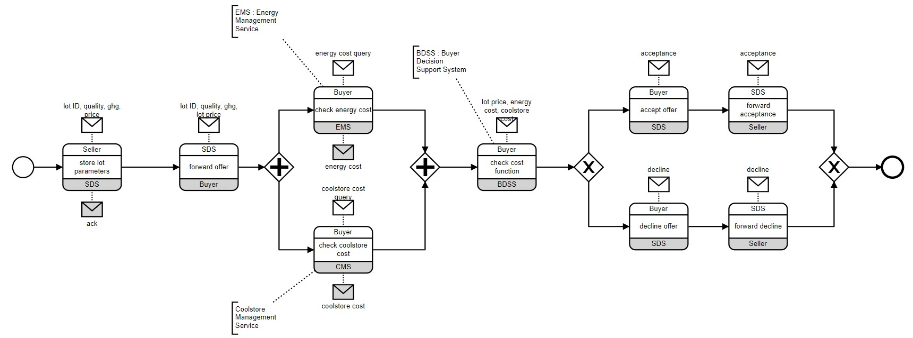

# BRAIN 2023 Tutorial
In this tutorial you can reproduce all the test used to write the paper for BRAIN 2023 workshop. Please, read the [README](README.md) in order to setup the CHOEN tool.

## Preliminaries
In the following we suggest a sequence of commands to test how the on-chain enforcer works. The following commands have been tested using Ganache and Sepolia .

Once you have activated the environment, you have to move in the bpmn2solidity folder and you can launch the CLI with the command `django-admin cli`. The tool now starts showing the outer prompt to the user (`>>`). The following steps you have to run are the following:

1. Execute the command `init` for inizialing the application (only the first time)
1. If this is the first time, execute the command `load <path/brain2023_running_example.bpmn>`. Otherwise execute the command `load brain2023_running_example`. Both commands load the choreography used for all the test
1. Execute the command `env ONCHAIN_URL = <your_ganache_url>` to set the URL of your test blockchain
1. Execute the command `env ONCHAIN_ID = <your_ganache_id>` to set the chain ID of your test blockchain
1. Execute the command `env ONCHAIN_ADDRESS = <your_wallet_address>` to set the address of your wallet
1. Execute the command `env ONCHAIN_PRIVATE_KEY = <your_private_key>` to set the private key associated with your adderss
1. Execute the command `start` for starting the enforcer and for generating and deploying the smart contract in the blockchain.

Note that after the `start` command, CHOEN switches from the outer prompt to the inner prompt (`+>`). This means that the enforcer is running and ready to process streams of  events provided by the user.

Note also that the tool *does store* your private key and address in the `${HOME}/.choen_cli` file, which is the history file of the outer prompt. You may consider to remove the file once you finish the experiments.

The choreography used for this example is the following.

The BPMN diagram can be found in the `public/brain2023/choreography_running_example.bpmn` and you can download it directly by clicking [here](public/brain2023/choreography_running_example.bpmn). You can see and inspect the choreography uploading the BPMN file onto the online tool [Chor-JS](https://bpt-lab.org/chor-js-demo/)

## Test 1 : Correct execution without reordering events
The first test aims to verify a correct execution of the choreography without buffering any events, so the idea is to input only events in such a way that they will trigger  the `receive_now` rule of the enforcer. To check what are the allowed transitions, once you are in the inner prompt (`+>`) you can enter the command `/dump transitions`. In this case you should obtain an output similar to the following, modulo the fact that State labels change at every execution:
```
 * State(epscrmlx) -[SDS?lot_ID,quality,ghg,price]-> State(huhaaktq)
 * State(bzexvtlu) -[]-> State(epscrmlx)
   State(glaoaszy) -[Seller?ack]-> State(mahaqzvp)
   State(huhaaktq) -[]-> State(glaoaszy)
   State(igwepomk) -[Buyer?lot_ID,quality,ghg,lot_price]-> State(xorqfcdq)
   State(mahaqzvp) -[]-> State(igwepomk)
   State(bfasuleu__bwratkop) -[CMS?coolstore_cost_query]-> State(bfasuleu__afperops)
   State(bfasuleu__bwratkop) -[EMS?energy_cost_query]-> State(jbuxtkyu__bwratkop)
   State(bfasuleu__afperops) -[]-> State(bfasuleu__vixpswlc)
   State(bfasuleu__afperops) -[EMS?energy_cost_query]-> State(jbuxtkyu__afperops)
   State(bfasuleu__vixpswlc) -[Buyer?coolstore_cost]-> State(bfasuleu__xnzticdz)
   State(bfasuleu__vixpswlc) -[EMS?energy_cost_query]-> State(jbuxtkyu__vixpswlc)
   State(bfasuleu__xnzticdz) -[EMS?energy_cost_query]-> State(jbuxtkyu__xnzticdz)
   State(jbuxtkyu__bwratkop) -[CMS?coolstore_cost_query]-> State(jbuxtkyu__afperops)
   State(jbuxtkyu__bwratkop) -[]-> State(vduzbvdn__bwratkop)
   State(jbuxtkyu__afperops) -[]-> State(vduzbvdn__afperops)
   State(jbuxtkyu__afperops) -[]-> State(jbuxtkyu__vixpswlc)
   State(jbuxtkyu__vixpswlc) -[Buyer?coolstore_cost]-> State(jbuxtkyu__xnzticdz)
   State(jbuxtkyu__vixpswlc) -[]-> State(vduzbvdn__vixpswlc)
   State(jbuxtkyu__xnzticdz) -[]-> State(vduzbvdn__xnzticdz)
   State(vduzbvdn__bwratkop) -[CMS?coolstore_cost_query]-> State(vduzbvdn__afperops)
   State(vduzbvdn__bwratkop) -[Buyer?energy_cost]-> State(ltdvcyso__bwratkop)
   State(vduzbvdn__afperops) -[]-> State(vduzbvdn__vixpswlc)
   State(vduzbvdn__afperops) -[Buyer?energy_cost]-> State(ltdvcyso__afperops)
   State(vduzbvdn__vixpswlc) -[Buyer?coolstore_cost]-> State(vduzbvdn__xnzticdz)
   State(vduzbvdn__vixpswlc) -[Buyer?energy_cost]-> State(ltdvcyso__vixpswlc)
   State(vduzbvdn__xnzticdz) -[Buyer?energy_cost]-> State(ltdvcyso__xnzticdz)
   State(ltdvcyso__bwratkop) -[CMS?coolstore_cost_query]-> State(ltdvcyso__afperops)
   State(ltdvcyso__afperops) -[]-> State(ltdvcyso__vixpswlc)
   State(ltdvcyso__vixpswlc) -[Buyer?coolstore_cost]-> State(ltdvcyso__xnzticdz)
   State(xorqfcdq) -[]-> State(bfasuleu__bwratkop)
   State(bpxdsqlg) -[BDSS?lot_price,energy_cost,coolstore_cost]-> State(pznutvwx)
   State(ltdvcyso__xnzticdz) -[]-> State(bpxdsqlg)
   State(qzehqjoy) -[SDS?acceptance]-> State(zncymiff)
   State(ozrmadio) -[Seller?acceptance]-> State(sydmtkhy)
   State(zncymiff) -[]-> State(ozrmadio)
   State(rihiocnj) -[]-> State(dszlzkkm)
   State(rihiocnj) -[]-> State(qzehqjoy)
   State(dszlzkkm) -[SDS?decline]-> State(solosftn)
   State(hzuupmql) -[Seller?decline]-> State(omubcauv)
   State(solosftn) -[]-> State(hzuupmql)
   State(pznutvwx) -[]-> State(rihiocnj)
   State(omubcauv) -[]-> State(oizxtrjv)
   State(sydmtkhy) -[]-> State(oizxtrjv)
```
So based on the previous transitions, a possibile stream of events to achieve our goal is the following:
```
SDS?lot_ID,quality,ghg,price Seller?ack Buyer?lot_ID,quality,ghg,lot_price EMS?energy_cost_query Buyer?energy_cost CMS?coolstore_cost_query Buyer?coolstore_cost BDSS?lot_price,energy_cost,coolstore_cost SDS?acceptance Seller?acceptance
```
Copying the stream of events in the CLI, the expected output should be the following:
```
+> SDS?lot_ID,quality,ghg,price Seller?ack Buyer?lot_ID,quality,ghg,lot_price EMS?energy_cost_query Buyer?energy_cost CMS?coolstore_cost_query Buyer?coolstore_cost BDSS?lot_price,energy_cost,coolstore_cost SDS?acceptance Seller?acceptance

** Process input: SDS?lot_ID,quality,ghg,price ... **
(* Condition rule receive now: SDS?lot_ID,quality,ghg,price *)

Output message: SDS?lot_ID,quality,ghg,price

** Process completed. **


** Checking for usable messages in buffer ...
(* No usable message found in buffer for current states. *)
** Checking completed. **


** Process input: Seller?ack ... **
(* Condition rule receive now: Seller?ack *)

Output message: Seller?ack

** Process completed. **


** Checking for usable messages in buffer ...
(* No usable message found in buffer for current states. *)
** Checking completed. **


** Process input: Buyer?lot_ID,quality,ghg,lot_price ... **
(* Condition rule receive now: Buyer?lot_ID,quality,ghg,lot_price *)

Output message: Buyer?lot_ID,quality,ghg,lot_price

** Process completed. **


** Process input: EMS?energy_cost_query ... **
(* Condition rule receive now: EMS?energy_cost_query *)

Output message: EMS?energy_cost_query

** Process completed. **


** Checking for usable messages in buffer ...
(* No usable message found in buffer for current states. *)
** Checking completed. **


** Process input: Buyer?energy_cost ... **
(* Condition rule receive now: Buyer?energy_cost *)

Output message: Buyer?energy_cost

** Process completed. **


** Checking for usable messages in buffer ...
(* No usable message found in buffer for current states. *)
** Checking completed. **


** Process input: CMS?coolstore_cost_query ... **
(* Condition rule receive now: CMS?coolstore_cost_query *)

Output message: CMS?coolstore_cost_query

** Process completed. **


** Checking for usable messages in buffer ...
(* No usable message found in buffer for current states. *)
** Checking completed. **


** Process input: Buyer?coolstore_cost ... **
(* Condition rule receive now: Buyer?coolstore_cost *)

Output message: Buyer?coolstore_cost

** Process completed. **


** Checking for usable messages in buffer ...
(* No usable message found in buffer for current states. *)
** Checking completed. **


** Process input: BDSS?lot_price,energy_cost,coolstore_cost ... **
(* Condition rule receive now: BDSS?lot_price,energy_cost,coolstore_cost *)

Output message: BDSS?lot_price,energy_cost,coolstore_cost

** Process completed. **


** Checking for usable messages in buffer ...
(* No usable message found in buffer for current states. *)
** Checking completed. **


** Process input: SDS?acceptance ... **
(* Condition rule receive now: SDS?acceptance *)

Output message: SDS?acceptance

** Process completed. **


** Checking for usable messages in buffer ...
(* No usable message found in buffer for current states. *)
** Checking completed. **


** Process input: Seller?acceptance ... **
(* Condition rule receive now: Seller?acceptance *)

Output message: Seller?acceptance

** Process completed. **


** Checking for usable messages in buffer ...
(* No usable message found in buffer for current states. *)
** Checking completed. **

(* Ended *)
```
As said in the beginning no event is added to the enforcer buffer, but every event triggers the `receive_now` rule, thus the choreography moves starightforwardly towards one of the end events.

## Test 2 : Correct execution reordering events
The second test aims to check the other rules, viz. `receive_delayed` and `receive_buffered`.
Imagine that right after the enforcer starts, the `SDS` actor requires to trigger the following event:  `SDS?lot_ID,quality,ghg,price`. The enforcer applies the rule `receive_now` and a transition is generated that moves the NFA behind the enforcer to a new state. Now we can execute the command `/dump transitions` and see that the possibile transitions in the new state are the following:
```
...
 * State(ywdwzqdf) -[Seller?ack]-> State(hdgwceud)
 * State(crprzznl) -[]-> State(ywdwzqdf)
 ...
```
Let's now try to "force" the system to move forward without waiting the acknowledge message `Seller?ack`. For instance, the actor `Buyer` might request the enforcer to trigger the event `Buyer?lot_ID,quality,ghg,lot_price`. In this case in the terminal we can see the following output:
```
+> Buyer?lot_ID,quality,ghg,lot_price

** Process input: Buyer?lot_ID,quality,ghg,lot_price ... **
(* Condition rule receive delayed: Buyer?lot_ID,quality,ghg,lot_price *)
** Process completed. **


** Checking for usable messages in buffer ...
(* No usable message found in buffer for current states. *)
** Checking completed. **
```
The CHOEN tool informed the user that rule `receive_delayed` has been applied and that the event is added to the buffer within the enforcer. We can check the state of the buffer by issuing the command `/history` in the inner prompt (`+>`). Note that no `Output message: ...` has been produced, meaning that the enforcer has temporarily suppressed the input event.
This shows that, at this stage, the enforcer can only transition to a new state once the `Seller` actor issues a request for the event `Seller?ack`. Hence, if you try to input the string `Seller?ack` on the CHOEN inner prompt, the enforcer reacts by first applying the rule `receive_now` (for the event `Seller?ack` just requested) and immediately after it applies the rule `receive_buffered` (for the event request `Buyer?lot_ID,quality,ghg,lot_price` that was previously buffered). An example of the output that is presented to the user is the following:
```
+>Seller?ack

** Process input: Seller?ack ... **
(* Condition rule receive now: Seller?ack *)

Output message: Seller?ack

** Process completed. **


** Checking for usable messages in buffer ...
(* Condition rule receive buffered: Buyer?lot_ID,quality,ghg,lot_price *)

Output message: Buyer?lot_ID,quality,ghg,lot_price

(* No usable message found in buffer for current states. *)
** Checking completed. **
```
Note that as a consequence of processing a single input event request (`Seller?ack`), two output events are produced (lines starting with `Output message: ...`).

## Test 3 : Suppressed events
The third test aims to show that buffered event requests may, in the "worst" case, be suppressed indefinitely. This happens in case the NFA behind the enforcer never reaches a state ready to "consume" the buffered event. Suppressed events neither blocks the execution of the enforcer, nor it blocks actors from sending new request for triggering other events.
Imagine, for instance, that the following stream of event requests is input in the enforcer:
```
SDS?lot_ID,quality,ghg,price Seller?ack Buyer?lot_ID,quality,ghg,lot_price EMS?energy_cost_query Buyer?energy_cost CMS?coolstore_cost_query Buyer?coolstore_cost BDSS?lot_price,energy_cost,coolstore_cost
```
With this set of events the choreography changes its state going to a position ready to execute the task called "check cost function" (i.e. corresponding to the actor `Sender` sending either the message `acceptance` or the message `decline` to the actor `SDS`). Next, we may simulate the `Seller` actor requests to receive the `decline` message (i.e. we can input the event request `Seller?decline`). The enforcer buffers this event request, because, as we have just explained, it is not allowed by the current state of the NFA.
```
+> Seller?decline

** Process input: Seller?decline ... **
(* Condition rule receive delayed: Seller?decline *)
** Process completed. **


** Checking for usable messages in buffer ...
(* No usable message found in buffer for current states. *)
** Checking completed. **
```
However, in this case the `SDS` actor decides not to send the event `SDS?decline` that would "unlock" and output the buffered event request. Instead it decides to follow the other branch of the choreography and requests to execute the event `SDS?acceptance` and next `Seller?acceptance`. This ends the enforcer excecution, because one of the end events is reached, causing the ChoEn tool to switch from the inner prompt (`+>`) to the outer prompt (`>>`). 

You can now inspect the state of the buffer (using the command: `dump buffer`) and see the suppressed event, or the history of the events allowed by the user (using the command: `history`). The output should be similar to the following:
```
...

event : BDSS?lot_price,energy_cost,coolstore_cost
curr_states : ['pxqjhase', 'fpndpsly', 'bhcvemvr', 'rximwfhf']
buffer : []


event : Seller?decline
curr_states : ['pxqjhase', 'fpndpsly', 'bhcvemvr', 'rximwfhf']
buffer : ['Seller?decline']


event : SDS?acceptance
curr_states : ['dfujdivz', 'hnymfogm']
buffer : ['Seller?decline']


event : Seller?acceptance
curr_states : ['fhfqoovt', 'rrggtafi']
buffer : ['Seller?decline']
```

